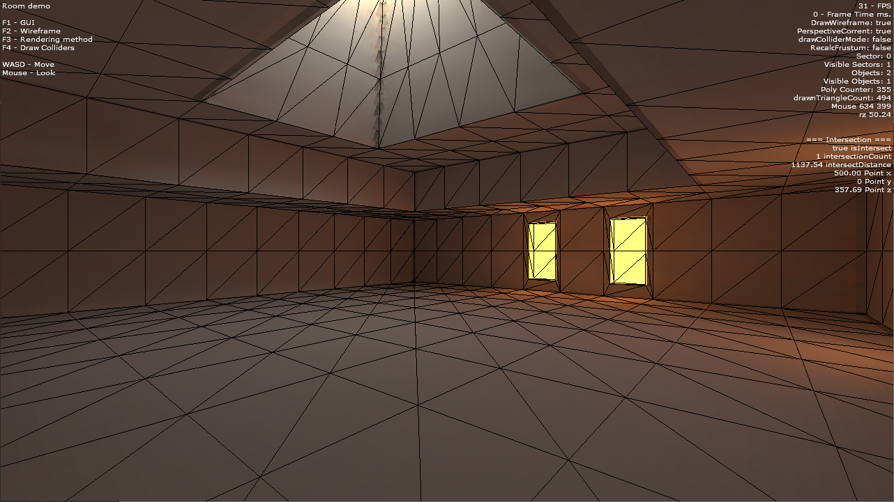

# crd3d Flash 3D Engine

crd3d is a Flash (SWF) 3D engine written in ActionScript years ago (2008-2012) and ported to Haxe later.

## Features

* Wavefront OBJ parser
* Cameras
* Viewports
* Flat shading
* Frustum culling
* Backface culling
* Z-clipping
* Fog 
* Animated 2D sprites support
* 3D line rendering (rays & lines)
* Scenes, scene sectors
* Two different rendering APIs support (lineTo & drawTriangles)
* Textures
* UV support
* Möller–Trumbore ray-mesh intersection
* Colliders

## Build requirements

* FlashDevelop 5.3.3.1 or newer
* Haxe 4.1.0 or newer
* Flash Player 11.1 or newer version up to 11.4 (11.5+ works but could introduce some performance issues)

## Building

* Install and configure tools
* Open crd3d_haxe project in FlashDevelop
* Right-click on any Main files (MainCube, MainGame), etc.
* Choose "Set Document Class"
* Press F5 to build and run
  
## Demos

## License

LICENSE.txt
